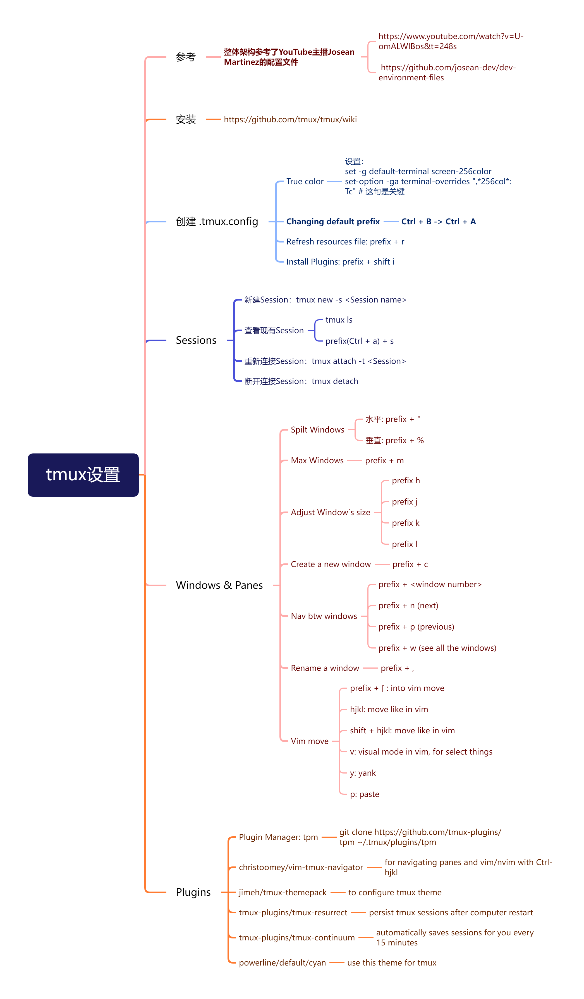

# 基于 Ubuntu 22.04 的命令行开发环境

<aside>
💡 本文配置基于[ZyWCN1998/MyDevEnvFile](https://github.com/ZyWCN1998/MyDevEnvFile) 仓库修改而来,如果你觉得有帮助，请给他点赞
</aside>

在 ZyWCN1998 的基础上：

1. .zshrc 中 plugins 加入 fd，以通过报错
2. 删掉了.zshrc 末尾的“e”字符+大佬自己的一生一芯环境变量
3. 将 nvim 文件夹中的 zhiyuanwu 改称了我自己的用户名，将 nvim/init.lua 中的路径一并修改
4. 将 nvim/lua/aemaeth/core/options.lua 中的 opt.tabstop&shiftwidth 修改成了自己习惯的 4
5. 将 nvim/lua/aemaeth/plugins/lsp/lspconfig.lua 中 164 行 sumneko_lua 修改为 lua_ls，好像是 server 那边改名字了
6. 同上将 nvim/lua/aemaeth/plugins/lsp/mason.lua 中的 29 行 sumneko_lua 修改为 lua_ls


# 1. 安装

## 1.1 准备工作

请确保安装了以下内容：

- **支持 TrueColor 的终端：**可以使用以下代码检查中断是否为 TureColorhttps://github.com/termstandard/colors，如果支持颜色条应该是连续的。
  ```bash
  awk 'BEGIN{
      s="/\\/\\/\\/\\/\\"; s=s s s s s s s s;
      for (colnum = 0; colnum<77; colnum++) {
          r = 255-(colnum*255/76);
          g = (colnum*510/76);
          b = (colnum*255/76);
          if (g>255) g = 510-g;
          printf "\033[48;2;%d;%d;%dm", r,g,b;
          printf "\033[38;2;%d;%d;%dm", 255-r,255-g,255-b;
          printf "%s\033[0m", substr(s,colnum+1,1);
      }
      printf "\n";
  }'
  ```
- **Nerdfont:** [Nerd Fonts - Iconic font aggregator, glyphs/icons collection, & fonts patcher](https://www.nerdfonts.com/)  
  推荐使用 mesloLGF Nerdfonts

  ```bash
  sudo mv Meslo /usr/share/fonts/
  sudo fc-cache -fv
  ```

  打开 Terminal-Preferences-Profiles-Text-Custom font，选择 MesloLGS Nerd Font

- **Ripgrep:** https://github.com/BurntSushi/ripgrep
  ```bash
  sudo apt install ripgrep
  ```
- **Tree-sitter CLI:** https://github.com/tree-sitter/tree-sitter-cli
  ```bash
  npm install -g tree-sitter-cli
  ```
- 将本仓库内容克隆到本地

## 1.2 Terminal 配置

### 安装 zsh

```bash
sudo apt install zsh
```

### 安装 ohmyzsh

OhMyZsh 网站：[https://ohmyz.sh/](https://ohmyz.sh/)

```bash
sh -c "$(curl -fsSL https://raw.githubusercontent.com/ohmyzsh/ohmyzsh/master/tools/install.sh)"
```

将本仓库中.zshrc 文件放置于~目录下即可

### 安装 powerlevel10k 主题

[powerlevel10k](https://github.com/romkatv/powerlevel10k#oh-my-zsh)

```bash
git clone --depth=1 https://github.com/romkatv/powerlevel10k.git ${ZSH_CUSTOM:-$HOME/.oh-my-zsh/custom}/themes/powerlevel10k
#chinese gitee
git clone --depth=1 https://gitee.com/romkatv/powerlevel10k.git ${ZSH_CUSTOM:-$HOME/.oh-my-zsh/custom}/themes/powerlevel10k
```

## 1.3 NeoVim 配置

### 安装 NeoVim

版本：V 0.82

NeoVim 网站：[https://neovim.io/](https://neovim.io/)

注：在 Ubuntu 22.04 上安装 NeoVim 需要手动在 Github 上下载包并安装，直接使用 sudo 命令获取的版本较老

```bash
1. Download nvim-linux64.deb
2. Install the package using sudo apt install ./nvim-linux64.deb
3. Run nvim
```

### 使用配置文件

在\~目录下新建.config 文件夹，如果有的话则不需要新建，将本仓库中的 nvim 文件夹放置于\~ /.config 目录下即可。

启动 nvim，使用命令:PackerSync 更新插件

有时可能缺少 python3_dev，按照提示安装即可


使用命令:Mason 安装对应语言服务


## 1.4 tmux 配置

### 安装 tmux

网站：[Home · tmux/tmux Wiki (github.com)](https://github.com/tmux/tmux/wiki)

```bash
sudo apt install tmux
```

### 使用配置文件

将仓库中提供的.tmux.config 文件放置于~目录下即可，进入 tmux 后使用快捷键 Ctrl + a + I (Shift i)安装需要的插件和主题即可

# 2. 具体插件与常用键位

所用插件基本与 josean 相同，Mason 中多安装了 SVLangserver/clangd/Pyright 等服务，具体请见思维导图

## Neovim 编辑器


## tmux 设置



# 3. 下一步工作

- [ ] 缩短 Nvim 启动时间至 100ms 以内（目前为 250ms 左右）
- [ ] 选定一个 DashBoard 图案
- [ ] 将命令行以及部分语言的调试器集成进来
